Here's a **professional and detailed `README.md` file** for your **Event Ticket Booking Management System**, based on your complete project and final report:

---

```markdown
# 🎫 Event Ticket Booking Management System

## 📌 Project Overview

The Event Ticket Booking Management System is a full-stack web application designed to simplify and digitize the process of booking tickets for events such as concerts, conferences, exhibitions, theatre shows, and more. It offers both users and admins dedicated interfaces to handle bookings and event management efficiently.

This system supports real-time seat selection, user authentication, booking history, and admin dashboards for managing events — all built using modern web technologies.

---

## 🚀 Features

### 👤 For Users
- User Registration and Login (Passport.js authentication)
- Browse upcoming events
- Real-time seat selection and booking
- View and cancel past bookings
- Responsive, mobile-friendly UI

### 🛠️ For Admins
- Admin authentication
- Create, read, update, and delete events
- View booking history
- Control ticket pricing and seat count

---

## 🧑‍💻 Technologies Used

### 🔷 Frontend
- **React.js** – Component-based UI
- **React-Bootstrap** – Responsive UI components
- **React-Router-Dom** – Client-side routing
- **Axios** – HTTP requests
- **HTML5, CSS3, JavaScript**

### 🔶 Backend
- **Node.js** – Runtime environment
- **Express.js** – Server and API routing
- **MySQL** – Relational database system
- **Passport.js** – Session-based authentication
- **bcrypt.js** – Password hashing
- **dotenv** – Environment variable management

### 📦 Additional Tools
- **Hoppscotch/Postman** – API testing
- **Git & GitHub** – Version control

---

## 🗃️ Database Schema

### 👤 Users Table
```sql
CREATE TABLE users (
  id INT PRIMARY KEY AUTO_INCREMENT,
  name VARCHAR(100),
  email VARCHAR(100) UNIQUE,
  password VARCHAR(255),
  role ENUM('user', 'admin') DEFAULT 'user'
);
```

### 🎉 Events Table
```sql
CREATE TABLE events (
  id INT PRIMARY KEY AUTO_INCREMENT,
  name VARCHAR(255),
  description TEXT,
  date DATE,
  time TIME,
  venue VARCHAR(255),
  total_seats INT,
  available_seats INT,
  price DECIMAL(10,2)
);
```

### 🧾 Bookings Table
```sql
CREATE TABLE bookings (
  id INT PRIMARY KEY AUTO_INCREMENT,
  user_id INT,
  event_id INT,
  seat_number VARCHAR(10),
  status ENUM('confirmed', 'cancelled') DEFAULT 'confirmed',
  created_at DATETIME,
  cancelled_at DATETIME,
  total_price INT,
  FOREIGN KEY (user_id) REFERENCES users(id) ON DELETE CASCADE,
  FOREIGN KEY (event_id) REFERENCES events(id) ON DELETE CASCADE,
  UNIQUE (event_id, seat_number)
);
```

---

## 🔐 Authentication

- Users and Admins are authenticated using **Passport.js Local Strategy**.
- Passwords are securely hashed using **bcrypt.js**.
- Admin routes are protected by middleware checks for role-based authorization.

---

## 🔁 API Endpoints

### 📥 Authentication
- `POST /api/auth/signup` – Register user
- `POST /api/auth/login` – Login user
- `GET /api/auth/logout` – Logout user

### 📅 Events
- `GET /api/events` – Get all events
- `POST /api/events` – Add new event (Admin)
- `PUT /api/events/:id` – Update event (Admin)
- `DELETE /api/events/:id` – Delete event (Admin)

### 🎟️ Bookings
- `POST /api/bookings` – Book ticket
- `GET /api/bookings/user/:id` – Get user bookings
- `PUT /api/bookings/cancel/:id` – Cancel booking
- `GET /api/bookings/event/:id` – Get booked seats for an event

---

## 💡 How to Run the Project

### 📁 1. Clone the Repository
```bash
git clone https://github.com/your-repo/event-ticket-booking-system.git
cd event-ticket-booking-system
```

### ⚙️ 2. Setup Backend
```bash
cd backend
npm install
```
- Create a `.env` file and add the following:
```env
DB_HOST=localhost
DB_USER=root
DB_PASS=yourpassword
DB_NAME=etbms
SESSION_SECRET=your_secret_key
```
- Run MySQL and create the database:
```sql
CREATE DATABASE etbms;
```
- Start the server:
```bash
npm start
```

### 🌐 3. Setup Frontend
```bash
cd frontend
npm install
npm run dev
```

---

## 📊 Output Screens

| User Flow | Admin Panel |
|-----------|-------------|
| Login, Register, Browse Events, Book Tickets | Create Event, Edit Event, Delete Event, View Bookings |


---

## 📸 Screenshots


### 📝 Signup Page
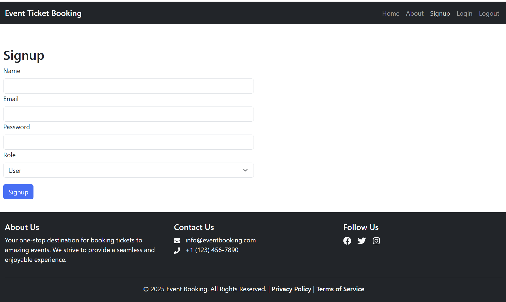

### 🔐 Login as User
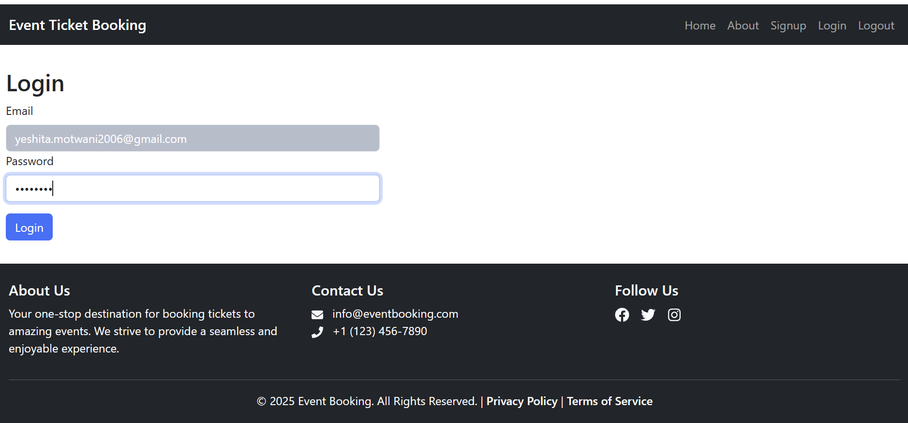

### 🏠 Home Page
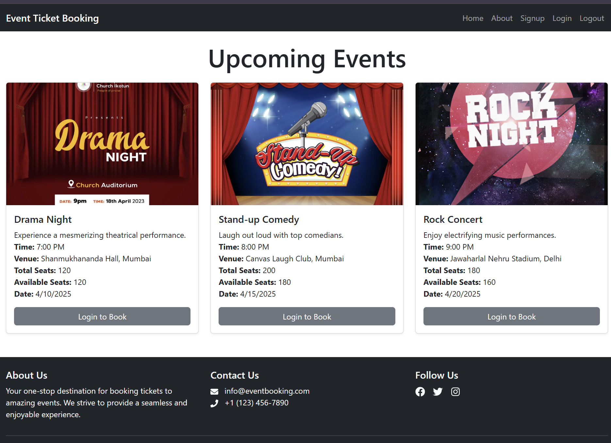

### 👥 About Us
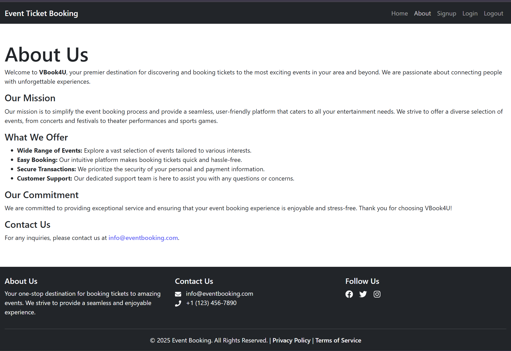

### 🔓 Home Page After Login
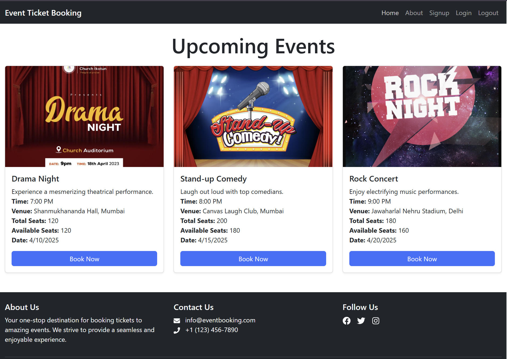

### 🛒 Booking Page
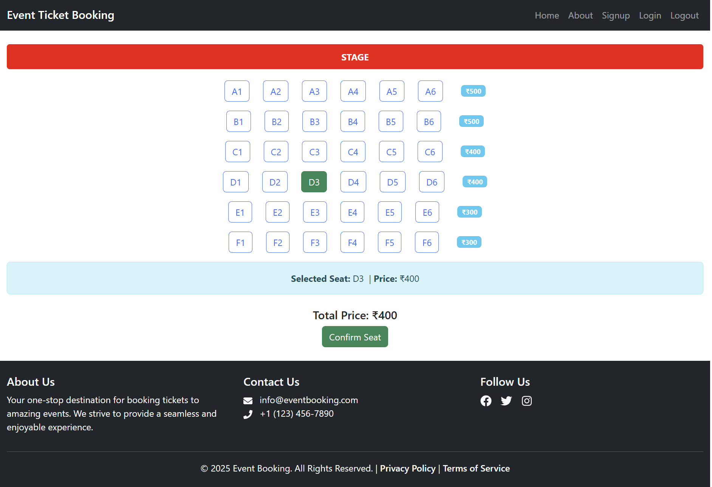

### 🎫 Proceed to Seat Selection
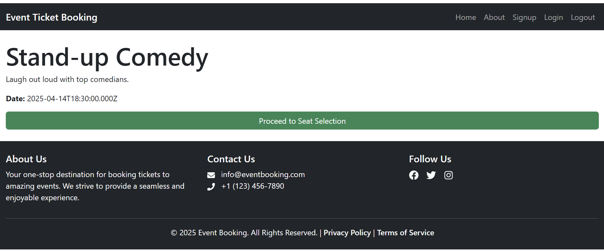

### ✅ Booking Confirmation
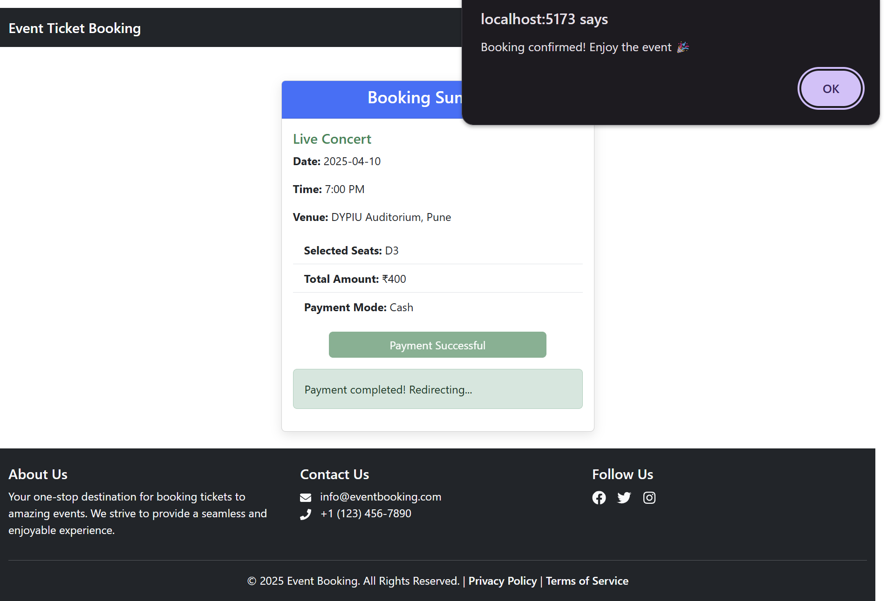

### 🧾 Booking Summary
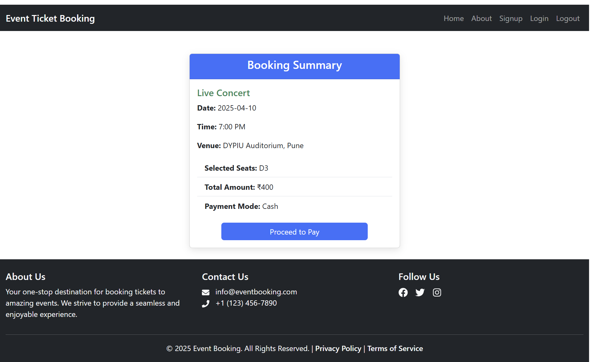

### 👤 User Dashboard
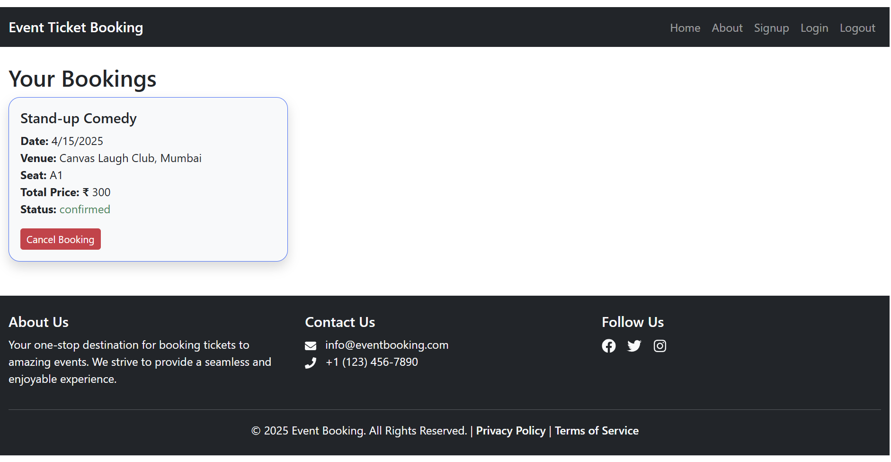


### 🔐 Login as Admin
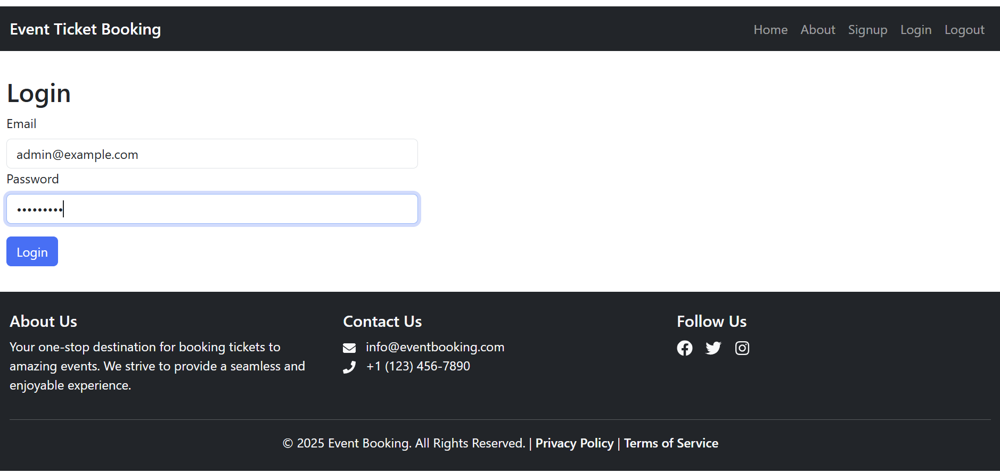

### 🧑‍💼 Admin Dashboard
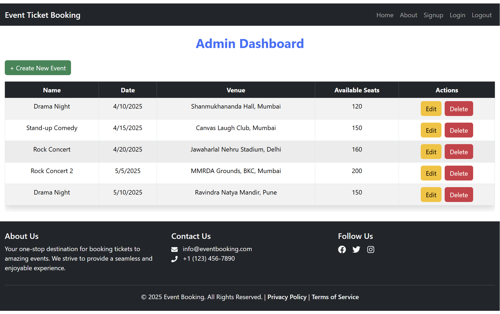

### ➕ Create Event Page
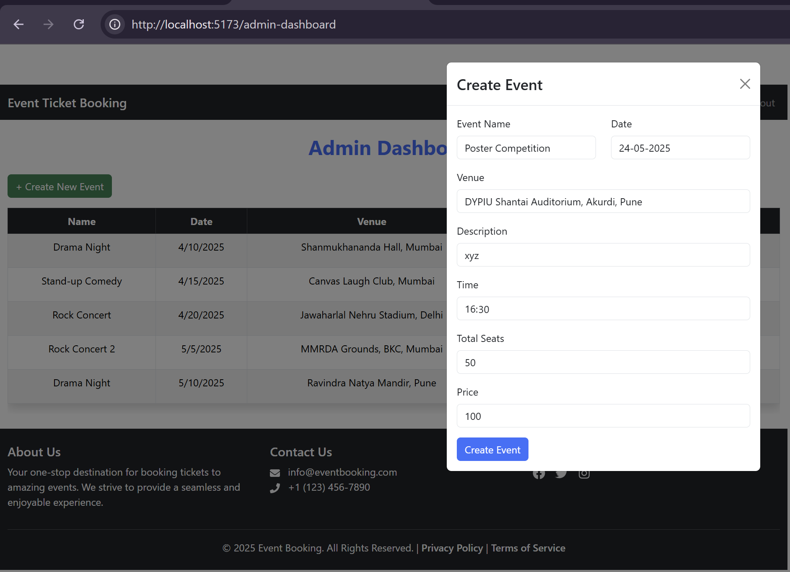


## 📈 Future Enhancements
- Payment gateway integration (e.g., Stripe/Razorpay)
- Email/SMS booking confirmation
- Real-time seat locking
- Mobile app version using React Native


## 📚 References

- [React.js Docs](https://reactjs.org/)
- [Express.js Docs](https://expressjs.com/)
- [MySQL Docs](https://dev.mysql.com/)
- [Passport.js Docs](http://www.passportjs.org/docs/)
- [bcrypt.js Docs](https://github.com/kelektiv/node.bcrypt.js)
- [Bootstrap Docs](https://getbootstrap.com/)
```
